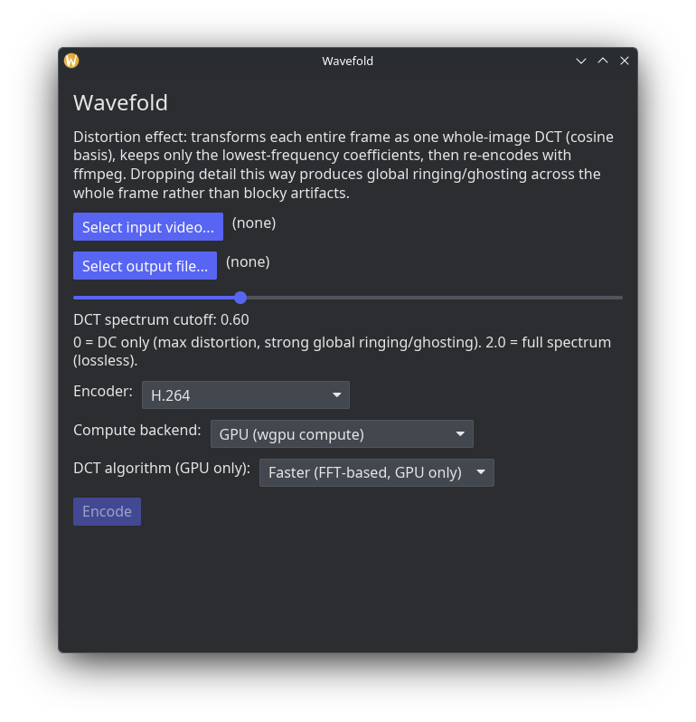

<!-- prettier-ignore -->
<div align="center">


# wavefold

_Whole-frame DCT distortion for video — global ringing and ghosting, not blocky compression artifacts_

[](https://github.com/HoppouDev/wavefold/actions/workflows/ci.yml)
[](https://github.com/HoppouDev/wavefold/releases)
[](LICENSE.md)

[Features](#features) • [How it works](#how-it-works) • [Install](#install) • [Usage](#usage) • [Supported codecs](#supported-codecs)

</div>

<div align="center">
  
</div>

wavefold decodes a video, runs a whole-frame (not block-based) DCT
compress/reconstruct pass on every frame, and re-encodes the result. Dropping
high-frequency detail this way produces global ringing and ghosting across
the entire frame, closer to an old analog tape artifact than the localized
blockiness of JPEG or block-based video codecs.

> [!NOTE]
> This is a visual-effect tool, not a real codec. The point is the
> ringing/ghosting artifact a DCT cutoff produces, not compression
> efficiency — output files are not meant to be small.

## Features

- **Whole-frame DCT** — the transform spans the entire frame, not 8×8
  blocks, so dropping high frequencies gives global ringing/ghosting instead
  of localized blockiness.
- **GPU or CPU compute** — GPU via [wgpu](https://wgpu.rs) (with a fast
  FFT-based DCT path alongside the original matrix-multiply one), or a
  pure-Rust CPU fallback that needs no GPU at all.
- **Software or hardware encoding** — x264/x265/vp9/av1, software or
  VAAPI/Media Foundation hardware, audio passed through untouched.
- **Cross-platform, no bundled runtime** — GStreamer on Linux/macOS, Media
  Foundation (built into the OS) on Windows.
- **GUI or headless CLI** — same binary; `wavefold encode` needs no display
  server, useful for batch jobs or CI.

## How it works

The effect is a straight forward+inverse DCT-II per frame: forward-transform
each color plane, zero out coefficients past a diagonal frequency cutoff,
then inverse-transform back to pixels. A cutoff near `0.0` keeps only the DC
coefficient (maximum distortion); `2.0` keeps the whole spectrum
(near-lossless). Because the transform runs over the _entire_ frame at once
rather than in small blocks, the coefficients that get dropped carry
information shared across the whole image — losing them produces smeared,
ghost-like artifacts rather than the tiled blockiness a block-based codec
like JPEG produces under similar loss.

## Install

### Pre-built releases

Download a build for your platform from the
[Releases page](https://github.com/HoppouDev/wavefold/releases): Linux
(x86_64/aarch64/riscv64) as a `.tar.gz`, Windows (x64/arm64) as a `.zip` or
an installer.

### Build from source

```bash
cargo build --release
```

You need Rust (stable). On Linux/macOS you also need GStreamer's development
headers to build, plus the actual plugins installed at runtime for whichever
codecs you use.

#### Arch Linux

```bash
sudo pacman -S --needed rust pkgconf clang base-devel \
  gstreamer gst-plugins-base gst-plugins-good gst-plugins-bad \
  gst-plugins-ugly gst-libav gst-plugin-va
```

`gst-plugin-va` (the VAAPI hardware-encode plugin) is packaged separately
from `gst-plugins-bad` — install it explicitly or `vah264enc`/etc. won't
exist.

#### Fedora

```bash
sudo dnf install rust cargo gcc clang pkgconf-pkg-config \
  gstreamer1-devel gstreamer1-plugins-base-devel gstreamer1-plugins-good
```

That's enough to build and run with `--encoder av1` (the only codec here
with a patent-unencumbered official-repo encoder). For x264/x265/vp9
software encoding and VAAPI hardware encoding, enable
[RPM Fusion](https://rpmfusion.org/) first:

```bash
sudo dnf install \
  https://mirrors.rpmfusion.org/free/fedora/rpmfusion-free-release-$(rpm -E %fedora).noarch.rpm \
  https://mirrors.rpmfusion.org/nonfree/fedora/rpmfusion-nonfree-release-$(rpm -E %fedora).noarch.rpm
sudo dnf install gstreamer1-plugins-bad-freeworld gstreamer1-plugins-ugly \
  gstreamer1-libav gstreamer1-vaapi
```

#### Ubuntu / Debian

```bash
sudo apt-get install pkg-config build-essential \
  libgstreamer1.0-dev libgstreamer-plugins-base1.0-dev \
  gstreamer1.0-plugins-good gstreamer1.0-plugins-bad gstreamer1.0-plugins-ugly \
  gstreamer1.0-libav gstreamer1.0-vaapi
```

Install Rust via [rustup](https://rustup.rs) — Ubuntu's packaged `rustc` is
usually too old.

#### openSUSE Tumbleweed

```bash
sudo zypper install rust cargo gcc clang pkg-config \
  gstreamer-devel gstreamer-plugins-base-devel \
  gstreamer-plugins-good gstreamer-plugins-bad gstreamer-plugins-ugly \
  gstreamer-plugins-libav
```

#### Alpine Linux

```sh
sudo apk add rust cargo build-base clang pkgconf \
  gstreamer-dev gst-plugins-base-dev \
  gst-plugins-good gst-plugins-bad gst-plugins-ugly gst-libav
```

Builds fine against musl — no special target needed.

#### NixOS

A `flake.nix` is included:

```bash
nix develop --command bash -c 'rustup default stable && cargo build --release'
```

Or without flakes:

```bash
nix-shell -p rustup gcc pkg-config \
  gst_all_1.gstreamer gst_all_1.gst-plugins-base gst_all_1.gst-plugins-good \
  gst_all_1.gst-plugins-bad gst_all_1.gst-plugins-ugly gst_all_1.gst-libav \
  --run 'rustup default stable && cargo build --release'
```

`rustup` inside the shell sidesteps nixpkgs' own `rustc` package lagging
behind what this crate needs. VAAPI (`vah264enc`/etc.) lives in
`gst-plugins-bad` since GStreamer 1.28.

#### Windows

Uses Media Foundation, which ships with Windows itself — no separate media
framework to install:

```powershell
cargo build --release
```

Just Rust ([rustup-init](https://rustup.rs), MSVC toolchain) needed.

> [!NOTE]
> Windows Media Foundation has a few platform-specific gaps compared to the
> GStreamer backend (a minimum input resolution, no software AV1 encoder,
> MP4 audio limited to AAC) — see `CLAUDE.md` for specifics. None of these
> are wavefold bugs; they're limitations of Windows' own built-in codec
> MFTs.

### Linux desktop shortcut

A `.desktop` file is in [`packaging/linux`](packaging/linux); the app icon
is [`assets/icon.svg`](assets/icon.svg):

```bash
cp packaging/linux/wavefold.desktop ~/.local/share/applications/
mkdir -p ~/.local/share/icons/hicolor/scalable/apps
cp assets/icon.svg ~/.local/share/icons/hicolor/scalable/apps/wavefold.svg
update-desktop-database ~/.local/share/applications 2>/dev/null
gtk-update-icon-cache ~/.local/share/icons/hicolor 2>/dev/null
```

Requires the `wavefold` binary on `PATH`.

## Usage

```bash
wavefold gui      # desktop GUI
wavefold encode <input> <output> [OPTIONS]   # headless, no display server needed
```

`encode` options:

| Flag                     | Default | Description                                                                                              |
| ------------------------ | ------- | -------------------------------------------------------------------------------------------------------- |
| `--cutoff <F>`           | `0.6`   | DCT spectrum cutoff, `0.0`–`2.0`. `0` = DC only (max distortion), `2.0` = full spectrum (near-lossless). |
| `--encoder <CODEC>`      | `h264`  | `h264`, `h265`, `vp9`, `av1`, or `-hardware` variants of each.                                           |
| `--backend <BACKEND>`    | `gpu`   | `gpu` or `cpu` compute backend for the DCT pass.                                                         |
| `--dct-algorithm <ALGO>` | `fft`   | `fft` (fast, GPU only) or `matmul` (original). Ignored under `--backend cpu`.                            |

```bash
wavefold encode input.mp4 output.mp4 --cutoff 0.3 --encoder av1-hardware
```

## Supported codecs

### GStreamer backend (Linux/macOS)

| Codec      | Software element | VAAPI hardware element | Notes                                                                       |
| ---------- | ---------------- | ---------------------- | --------------------------------------------------------------------------- |
| H.264      | `x264enc`        | `vah264enc`            |                                                                             |
| H.265/HEVC | `x265enc`        | `vah265enc`            |                                                                             |
| VP9        | `vp9enc`         | — (not available)      | No GPU ships VAAPI VP9 encode. Software VP9 must mux to `.mkv`, not `.mp4`. |
| AV1        | `av1enc`         | `vaav1enc`             |                                                                             |

### Media Foundation backend (Windows)

Media Foundation auto-negotiates whichever encoder MFT is registered for the
requested codec — there's no fixed element name the way GStreamer has.
`--encoder <codec>-hardware` allows (not forces) a hardware MFT; the plain
variant forces software.

| Codec      | Notes                                                                                                                 |
| ---------- | --------------------------------------------------------------------------------------------------------------------- |
| H.264      |                                                                                                                       |
| H.265/HEVC |                                                                                                                       |
| VP9        | Windows ships an MF _decoder_ for VP9, not an encoder — same gap as the GStreamer backend's missing VAAPI VP9 encode. |
| AV1        | Encoder availability depends on what's registered on the system (varies by Windows version/hardware).                 |

Output container is inferred from the file extension by Media Foundation's
own byte-stream-handler resolution — reliably `.mp4`/`.mov`; unlike the
GStreamer backend there's no built-in non-MP4 fallback, so a `.mkv` output
fails cleanly instead of muxing.

## Development

`CLAUDE.md` documents the full architecture in depth — decode/encode
backends, the GPU DCT compute pipeline, and the reasoning behind the more
subtle design decisions.

```bash
cargo check                  # fast typecheck
cargo test --release         # unit + integration tests
cargo build --release --features automation   # + localhost IPC for GUI testing
```

> [!TIP]
> The `automation` feature exposes a localhost JSON IPC server that drives
> the GUI's real message loop directly — useful for scripting/testing the
> app without OS-level input injection. See
> [`.agents/skills/wavefold-gui-automation`](.agents/skills/wavefold-gui-automation)
> for the protocol.
